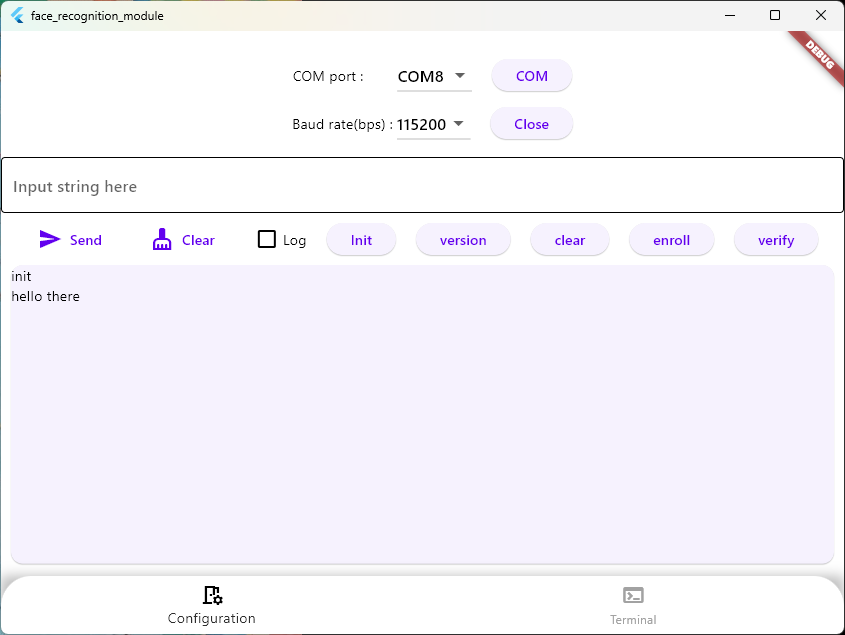

# face_recognition_module

App for test FR module via UART, windows

## *** This code is based on fast_app base framework so complicates

  

# Getting Started

1. Run app
2. Press COM and fnd your UART ports
3. Select port number to open and press Open
4. If you see snackbar message, open ok, then you write your text on 'input string here'
5. or you can press buttons and you can send text data via UART
6. You'll see received message via text box in light blue
